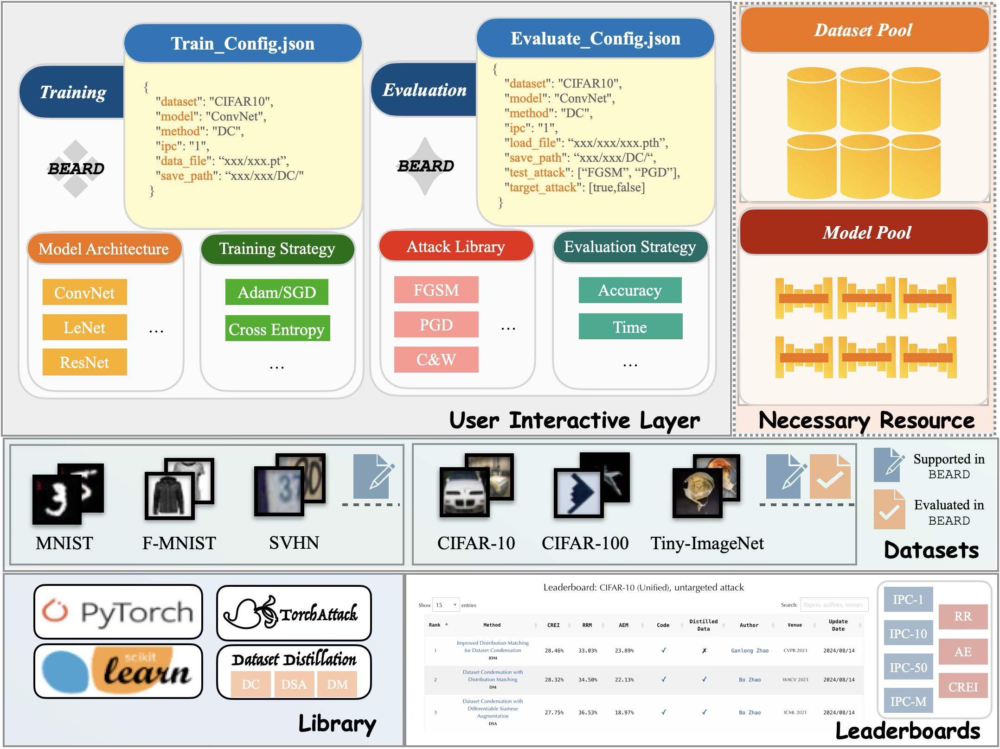

<p align="center">

</p>

<div align="center">

[Zheng Zhou](https://zhouzhengqd.github.io/)<sup>1</sup> &nbsp; [Wenquan Feng](https://shi.buaa.edu.cn/fengwenquan/zh_CN/index/132879/list/)<sup>1</sup> &nbsp; [Shuchang Lyu](https://scholar.google.com/citations?user=SwGcxzMAAAAJ&hl=en)<sup>1</sup> &nbsp; [Guangliang Cheng](https://sites.google.com/view/guangliangcheng)<sup>2</sup> &nbsp; [Xiaowei Huang](https://cgi.csc.liv.ac.uk/~xiaowei/)<sup>2</sup> &nbsp; [Qi Zhao](https://shi.buaa.edu.cn/07297/zh_CN/index.htm)<sup>1</sup>

<sup>1</sup> Beihang Univerisity &nbsp; <sup>2</sup> University of Liverpool


</div>

---
<span class="links">
  <a  href="https://arxiv.org/abs/2411.09265" rel="nofollow"></a>
  <a href="https://beard-leaderboard.github.io/" rel="nofollow"></a>
  <a href="https://github.com/zhouzhengqd/BEARDt"></a>
  <a href="https://share.multcloud.link/share/a51b64d1-063c-4a5c-a7b2-667cf94da71a" rel="nofollow"></a>
  <a href="https://share.multcloud.link/share/7dd850f1-b263-4f8b-9777-8e3134250187" rel="nofollow"></a>
</span>

*Welcome to the official PyTorch implementation of [BEARD: Benchmarking the Adversarial Robustness for Dataset Distillation](https://arxiv.org/abs/2411.09265).*

BEARD is an open-source benchmark specifically designed to evaluate and improve the **adversarial robustness** of Dataset Distillation (DD) methods. It provides a comprehensive assessment across three key stages: **distillation**, **training**, and **evaluation**.

<p align="center">

</p>

🔹 Explore  the **official leaderboard** here: **[BEARD Leaderboard](https://beard-leaderboard.github.io/)**

**❗Note❗: If you encounter any issues, please feel free to contact us via email: zhengzhou@buaa.edu.cn.**

## 🚀 What's New?  

- **Mar. 2025**: We have updated our attack library with **transfer-based** and **query-based black-box attacks** along with their evaluation files.  
- **Sep. 2024**: The full BEARD codebase is now open-source! 🎉 Access it here: [BEARD GitHub Repository](https://github.com/zhouzhengqd/BEARD).  
- **Aug. 2024**: The first full release of the BEARD benchmark project.  

## 🎯 Overview of BEARD

<p align="center">

</p>

BEARD addresses a critical gap in **dataset distillation** research by providing a systematic framework for evaluating adversarial robustness. While significant progress has been made in DD, deep learning models trained on distilled datasets remain vulnerable to adversarial attacks, posing risks in real-world applications.

### 🔥 Key Features:
- **Unified Benchmark**: Evaluate DD methods across multiple datasets and attack scenarios.
- **New Evaluation Metrics**: Includes the **Robustness Ratio (RR)**, **Attack Efficiency Ratio (AE)**, and **Comprehensive Robustness-Efficiency Index (CREI)**.
- **Open-Source Tools**: Easily integrate and evaluate the robustness of your DD methods with BEARD's extensible framework.

## 🛠 Getting Started
Follow the steps below to set up the environment and run the BEARD benchmark.

### Step 1: Clone the Repository
- Run the following command to download the Repo.
  ```
  git clone https://github.com/zhouzhengqd/BEARD.git
  ```
### Step 2: Download Dataset and Model Pools
- Download the required files and place them in the appropriate directories: [Data](https://share.multcloud.link/share/bbe57236-3ca2-42b2-aa10-88394c2c4b04) | [Dataset Pool](https://share.multcloud.link/share/a51b64d1-063c-4a5c-a7b2-667cf94da71a) | [Model Pool](https://share.multcloud.link/share/7dd850f1-b263-4f8b-9777-8e3134250187).
- ❗**Alternative Access**: If you are unable to access the **MultCloud** drive, you can find the files on **Google Drive**: [Data](https://drive.google.com/drive/folders/1ntfXLEFHRPFPC3JG_hFOkcrEh5BKSzsp?usp=drive_link) | [Dataset Pool](https://drive.google.com/drive/folders/1gtgmGEM7zZXG0al-iJQsxxhTiOD5SqLG?usp=drive_link) | [Model Pool](https://drive.google.com/drive/folders/1tFK0GTWNrFp0Vu-L_lN1WXGndiPnldZq?usp=drive_link).

### Step 3: Set Up the Conda Environment
- Run the following command to create a conda environment
    ```
    cd BEARD
    cd Code
    conda env create -f environment.yml
    conda activate beard
    ```
## 📁 Directory Structure
- `BACON`
    - `Code`
        - `data`
          - `datasets`
        - `dataset_pool`
        - `model_pool`
        - `evaluate_model.py`
        - `train_model.py`
        - `evaluate_model_blackbox.py`
        - `evaluate_config.json`
        - `train_config.json`
        - `evaluate_config_blackbox.json`
        - Files for BEARD
        - `enviroment.yml`
        - ...
        - ...
        - ...
## 🚦 Quick Evaluation Command
### Step 1: Download Dataset and Model Pools
- Ensure you have downloaded the dataset and model pools from the links provided above.
### Step 2: Modify Evaluation Configuration
- Adjust the evaluation configuration by editing the `evaluate_config.json` file based on your requirements.
### Step 3: Run the Evaluation Script
- Execute the evaluation to assess adversarial robustness:
  ```
    python evaluate_model.py --config ./evaluate_config.json
  ```
- To evaluate **transfer-based black-box attacks**, use:
  ```
    python evaluate_config_blackbox.py --config ./evaluate_config_blackbox.json
  ```
- **Note:** If your model was trained using **distributed training**, ensure that you also use the corresponding **distributed evaluation** setup for consistency. For instance, **IDM** in the model pool is trained with distributed training, so we provide a **single-GPU version** in the model pool for evaluation.
## ➕ Adding New Datasets and Models
### Step 1: Add Datasets
- Place the newly generated distilled datasets in the `dataset_pool` directory.
### Step 2: Modify Training Configuration
- Adjust the training configuration by editing the `train_config.json` file to specify the new datasets.
### Step 3: Run the Training Script
- Train the models on the new datasets:
  ```
    python train_model.py --config ./train_config.json
  ```
### Step 4: Evaluate the Models
- Once the models are trained, follow the evaluation steps outlined in the "Quick Evaluation Command" section to evaluate adversarial robustness.

## 🌐 Join the Community
If you're working on DD or adversarial robustness, we invite you to contribute to the BEARD benchmark, explore the leaderboard, and share your insights.

## 🙏 Acknowledgments

We would like to thank the contributors of the following projects that inspired and supported this work:

- [DC, DSA, DM](https://github.com/VICO-UoE/DatasetCondensation)
- [MTT](https://github.com/GeorgeCazenavette/mtt-distillation)
- [IDM](https://github.com/uitrbn/IDM)
- [BACON](https://github.com/zhouzhengqd/BACON)
- [torchattacks](https://github.com/Harry24k/adversarial-attacks-pytorch)

## 📚 Citation
```
@inproceedings{zhou2025beard,
  title={BEARD: Benchmarking the Adversarial Robustness for Dataset Distillation},
  author={Zhou, Zheng and Feng, Wenquan and Lyu, Shuchang and Cheng, Guangliang and Huang, Xiaowei and Zhao, Qi},
  booktitle={Proceedings of the IEEE/CVF Conference on Computer Vision and Pattern Recognition (CVPR)},
  year={2025}
}
```

## 🌟 Star History

[](https://star-history.com/#zhouzhengqd/BEARD&Date)